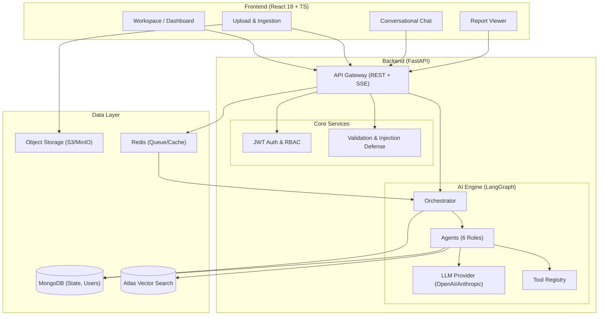
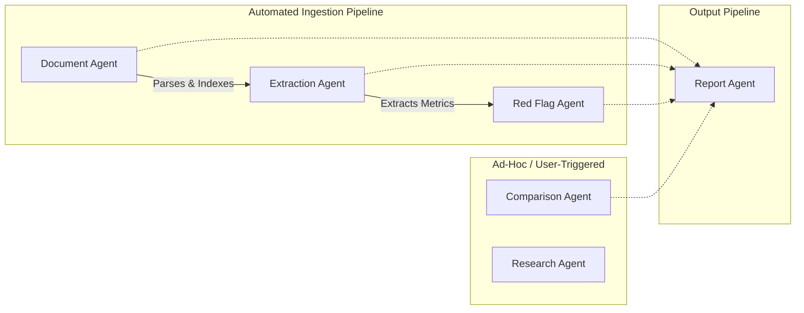
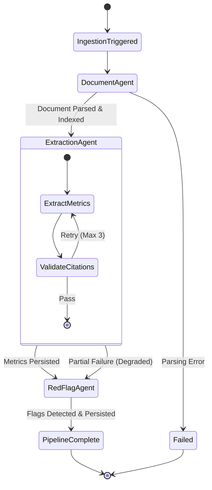

# 📈 Velsora — The Multi-Agent Financial Research Platform

**Velsora** is an AI-powered platform where a team of specialized AI agents collaborate to read, analyze, and generate insights from real company financial documents. Designed as a pilot-scale solution, it enforces **strict source grounding** (every insight is traceable to source documents) and features **automatic multi-agent triggering** to streamline the extraction, red-flag detection, comparison, and reporting processes.

---

## 🌟 Key Features

### 📄 Intelligent Document Ingestion & Parsing

- **Multi-Format Support** — Upload financial filings in PDF, DOCX, and TXT formats (up to 50MB).
- **Advanced OCR & Chunking** — Page-boundary aware text extraction with automatic OCR fallback for scanned documents.
- **Semantic Vector Indexing** — Automated embedding generation and vector indexing using MongoDB Atlas Vector Search for precise retrieval.

### 🤖 Multi-Agent Intelligence

- **6 Specialized Agents** — Document, Extraction, Red Flag, Comparison, Research, and Report Agents.
- **Metric Extraction Engine** — Automatically pulls revenue, EBITDA, EPS, and other key ratios with exact source citations.
- **Red Flag Classifier** — Detects and categorizes risks (Liquidity, Profitability, Governance) with low-to-critical severity levels.
- **Conversational Research Assistant** — Answers multi-part queries with step-by-step reasoning, RAG context, and strict grounding validation.
- **Automated Report Generation** — Compiles cross-agent analytics into structured, analyst-style PDF reports.

### ⚙️ Orchestration & State Management

- **Event-Driven Pipelines** — Pipeline triggers automatically upon document upload without blocking the UI.
- **Durable Handoffs** — Stateful LangGraph orchestrator ensures intermediate agent outputs are persisted in MongoDB.
- **Fault Tolerance & Recovery** — Bounded retry policies, exponential backoff, and graceful degradation strategies for LLM timeouts.
- **Tool Registry Access** — Agents are restricted to specific capability-based tools (e.g., `vector_search`, `pdf_parse`, `schema_validate`).

### 🔒 Security, Trust & Grounding

- **Strict Source Grounding** — The system guarantees every insight is backed by a specific page/chunk in the source documents.
- **Zero-Tolerance Hallucination Checks** — The Research Agent refuses to answer if relevant source material is unavailable.
- **Prompt Injection Defense** — Rigorous input validation before expensive LLM calls.
- **Role-Based Access Control** — Secure workspaces managed via JWT authentication for Admins, Analysts, and Viewers.

---

## 🏗️ System Architecture

---

## 🧠 AI Architecture

The AI architecture strictly enforces separation of concerns. Instead of a single monolithic prompt, tasks are delegated to a set of specialized, highly cohesive agents.

---

## ⚙️ AI Orchestration

Agent orchestration relies on stateful graphs to manage durable handoffs, retries, and graceful degradations. Each handoff is persisted via the database.

---

## 🚀 Getting Started

### Prerequisites

- **Python 3.10+** (Backend API & Workers)
- **Node.js 18+** (Frontend React App)
- **MongoDB** (State and Vector Database)
- **Redis** (Optional: for Celery async queue management)
- API Keys for your preferred LLM provider (OpenAI / Anthropic)

---

## 🔗 Links

---

*Built with ❤️ to revolutionize autonomous financial intelligence.*
